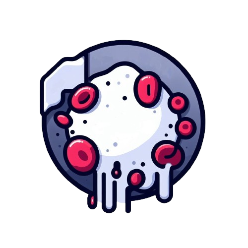
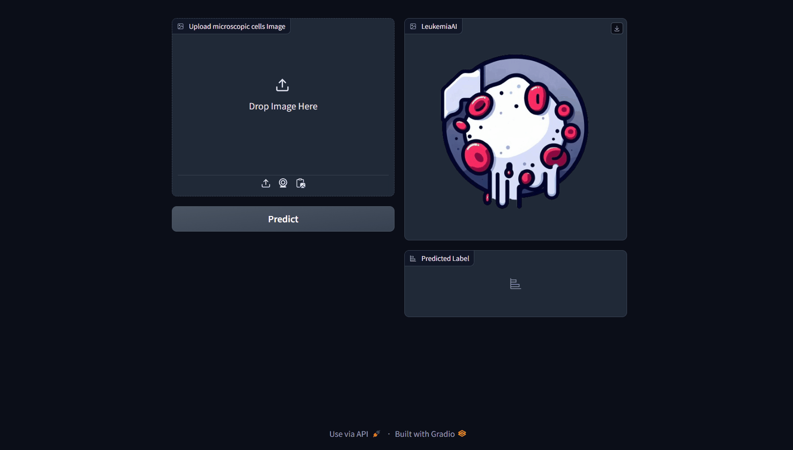

# **LeukemiaAI**

**A Revolutionary Tool in the Fight Against ALL** <br>
a fully integrated AI Classification pipeline to detect Acute lymphocytic leukemia (ALL)

## **Dataset**
Visit: https://www.kaggle.com/datasets/andrewmvd/leukemia-classification/data <br>
to view the Data Card on Kaggle

## **Fine-tuned Model**
Visit This HuggingFace repo: https://huggingface.co/SuperMaker/vit-base-patch16-224-in21k-leukemia <br>
to view the fine-tuned ViT (Vision Transformer) model and its specifications.

## **Research**
To understand all about how ViT was finetuned and the hyperparameter selection please see `research/LeukemiaAIResearch`

## **Demo**

After cloning, open a terminal and run:

linux/mac:
```bash
$ python -m venv .leukemiaAI
$ source .leukemiaAI/bin/activate
```
windows:
```bash
$ python -m venv .leukemiaAI
$ .leukemiaAI\Scripts\activate.bat
```

* download dependencies.

```bash
$ pip install -r requirements.txt
```

* run the app.

```bash
$ gradio LeukemiaAI/app.py
```
## How to use it?

### After running the app a window wil open up like this.


you can upload your cell microscopic image and it'll classifiy it. <br>


## **Pipeline**

if you want to get the data and model automatically. <br>
run the pipeline:

```bash
$ python LeukemiaAI/main.py
```

* **stage 01**: it will first fetch the data from kaggle and unzip it. **Check config/config.yml** to understand where the data will be placed in the project.
* **stage 02**: it will clone my huggingface repo. **Check config/config.yml** to understand more.

**Note**: to monitor the pipeline, please check your logs.
